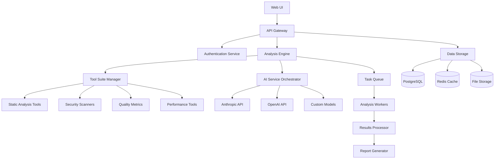
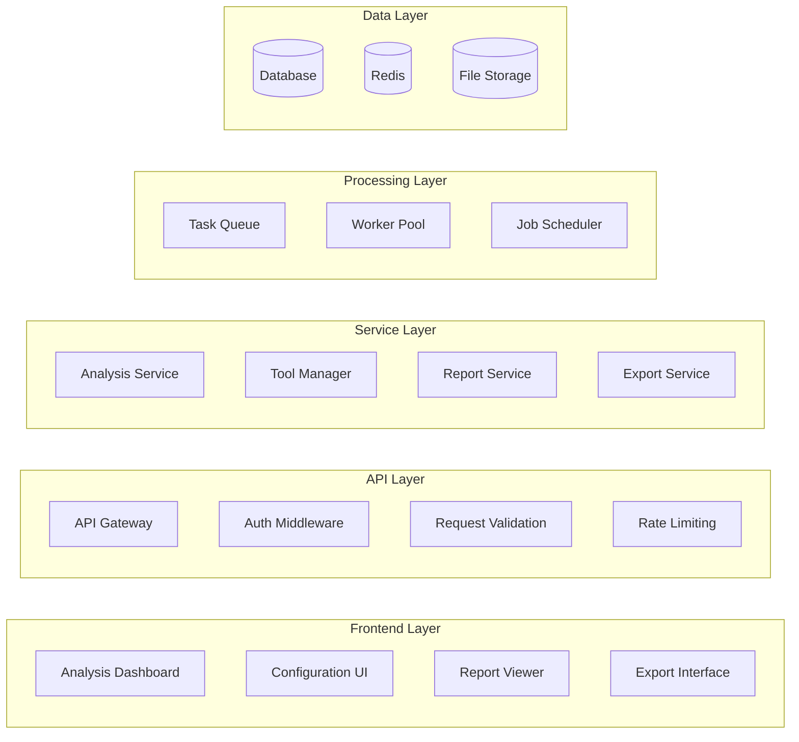

# Advanced Codebase Analysis System - Design

## Overview

The Advanced Codebase Analysis System extends OrbitSpace with comprehensive codebase analysis capabilities, featuring user-managed API keys, multi-mode analysis, and a complete suite of 60+ analysis tools. The system provides deep insights into code quality, security, performance, and architecture.

## Architecture

### High-Level Architecture



### Component Architecture



## Components and Interfaces

### 1. API Key Management Service

**Purpose**: Securely manage user API keys for external services

**Key Classes**:
- `APIKeyManager`: Handles encryption, storage, and validation
- `KeyVault`: Secure storage interface
- `ProviderValidator`: Validates keys for different AI providers

**Interfaces**:
```typescript
interface APIKeyService {
  storeKey(userId: string, provider: string, key: string): Promise<void>
  getKey(userId: string, provider: string): Promise<string | null>
  validateKey(provider: string, key: string): Promise<boolean>
  deleteKey(userId: string, provider: string): Promise<void>
  listProviders(userId: string): Promise<string[]>
}
```

### 2. Codebase Locator and Importer

**Purpose**: Import codebases from various sources and create searchable indexes

**Key Classes**:
- `CodebaseImporter`: Handles different import sources
- `GitCloner`: Clones repositories from Git providers
- `FileProcessor`: Processes uploaded files
- `LanguageDetector`: Identifies programming languages and frameworks

**Interfaces**:
```typescript
interface CodebaseImporter {
  importFromGit(url: string, credentials?: GitCredentials): Promise<Codebase>
  importFromUpload(files: File[]): Promise<Codebase>
  importFromURL(url: string): Promise<Codebase>
  createIndex(codebase: Codebase): Promise<CodebaseIndex>
}
```

### 3. Analysis Engine

**Purpose**: Core analysis orchestration and execution

**Key Classes**:
- `AnalysisOrchestrator`: Manages analysis workflows
- `ModeSelector`: Determines tools based on analysis mode
- `DependencyAnalyzer`: Analyzes code dependencies
- `ArchitectureAnalyzer`: Analyzes system architecture

**Interfaces**:
```typescript
interface AnalysisEngine {
  startAnalysis(codebase: Codebase, mode: AnalysisMode, tools: Tool[]): Promise<AnalysisSession>
  getAnalysisStatus(sessionId: string): Promise<AnalysisStatus>
  cancelAnalysis(sessionId: string): Promise<void>
  getResults(sessionId: string): Promise<AnalysisResults>
}
```

### 4. Tool Suite Manager

**Purpose**: Manages and executes the 60+ analysis tools

**Tool Categories**:

#### Static Analysis Tools (15 tools)
- ESLint, TSLint, Pylint, RuboCop, Checkstyle
- SonarQube, CodeClimate, Codacy
- Language-specific analyzers (Go vet, Rust clippy, etc.)

#### Security Scanners (12 tools)
- Bandit (Python), Brakeman (Ruby), ESLint Security
- Snyk, OWASP Dependency Check, Safety
- Secret scanners (GitLeaks, TruffleHog)
- SAST tools (Semgrep, CodeQL)

#### Code Quality Tools (10 tools)
- Prettier, Black, gofmt, rustfmt
- Complexity analyzers (McCabe, Halstead)
- Duplication detectors (PMD CPD, SonarQube)
- Test coverage analyzers

#### Performance Tools (8 tools)
- Profilers (py-spy, perf, pprof)
- Memory analyzers (Valgrind, AddressSanitizer)
- Bundle analyzers (webpack-bundle-analyzer)
- Performance linters

#### Documentation Tools (6 tools)
- JSDoc, Sphinx, Doxygen
- README analyzers
- API documentation generators
- Comment quality analyzers

#### Architecture Tools (9 tools)
- Dependency analyzers (madge, jdeps)
- Architecture validators
- Design pattern detectors
- Coupling/cohesion analyzers
- Dead code detectors

**Interfaces**:
```typescript
interface ToolSuite {
  getAvailableTools(): Promise<Tool[]>
  getToolsByCategory(category: ToolCategory): Promise<Tool[]>
  executeTool(tool: Tool, codebase: Codebase): Promise<ToolResult>
  getToolConfiguration(toolId: string): Promise<ToolConfig>
  updateToolConfiguration(toolId: string, config: ToolConfig): Promise<void>
}
```

### 5. AI Service Orchestrator

**Purpose**: Manage AI-powered analysis using user API keys

**Key Classes**:
- `AIOrchestrator`: Routes requests to appropriate AI services
- `AnthropicClient`: Handles Anthropic API integration
- `OpenAIClient`: Handles OpenAI API integration
- `PromptManager`: Manages analysis prompts and templates

**Interfaces**:
```typescript
interface AIService {
  analyzeCode(code: string, context: AnalysisContext, apiKey: string): Promise<AIAnalysisResult>
  generateRecommendations(results: ToolResult[], apiKey: string): Promise<Recommendation[]>
  explainIssues(issues: Issue[], apiKey: string): Promise<Explanation[]>
  suggestRefactoring(code: string, apiKey: string): Promise<RefactoringSuggestion[]>
}
```

### 6. Analysis Modes

**Normal Mode**:
- Basic static analysis (5-10 tools)
- Language-specific linting
- Basic security scanning
- Simple metrics collection
- Estimated time: 2-5 minutes

**Standard Mode**:
- Comprehensive static analysis (20-30 tools)
- Security vulnerability scanning
- Code quality metrics
- Dependency analysis
- Basic performance analysis
- Estimated time: 10-20 minutes

**Deep Mode**:
- All available tools (60+ tools)
- Advanced security auditing
- Performance profiling
- Architecture analysis
- AI-powered recommendations
- Custom rule validation
- Estimated time: 30-60 minutes

### 7. Report Generator

**Purpose**: Generate comprehensive analysis reports

**Key Classes**:
- `ReportGenerator`: Creates reports in various formats
- `TemplateEngine`: Manages report templates
- `DataAggregator`: Aggregates analysis results
- `VisualizationEngine`: Creates charts and graphs

**Report Types**:
- Executive Summary (PDF)
- Technical Report (HTML/PDF)
- JSON API Response
- Markdown Documentation
- Interactive Dashboard

## Data Models

### Database Schema Extensions

```sql
-- API Keys (encrypted)
CREATE TABLE user_api_keys (
    id UUID PRIMARY KEY DEFAULT gen_random_uuid(),
    user_id UUID REFERENCES users(id) ON DELETE CASCADE,
    provider VARCHAR(50) NOT NULL,
    encrypted_key TEXT NOT NULL,
    created_at TIMESTAMP DEFAULT NOW(),
    updated_at TIMESTAMP DEFAULT NOW(),
    UNIQUE(user_id, provider)
);

-- Codebases
CREATE TABLE codebases (
    id UUID PRIMARY KEY DEFAULT gen_random_uuid(),
    user_id UUID REFERENCES users(id) ON DELETE CASCADE,
    name VARCHAR(255) NOT NULL,
    source_type VARCHAR(50) NOT NULL, -- git, upload, url
    source_url TEXT,
    language_primary VARCHAR(50),
    languages JSONB,
    framework_info JSONB,
    file_count INTEGER,
    line_count INTEGER,
    size_bytes BIGINT,
    created_at TIMESTAMP DEFAULT NOW(),
    updated_at TIMESTAMP DEFAULT NOW()
);

-- Analysis Sessions
CREATE TABLE analysis_sessions (
    id UUID PRIMARY KEY DEFAULT gen_random_uuid(),
    codebase_id UUID REFERENCES codebases(id) ON DELETE CASCADE,
    user_id UUID REFERENCES users(id) ON DELETE CASCADE,
    mode VARCHAR(20) NOT NULL, -- normal, standard, deep
    status VARCHAR(20) DEFAULT 'pending', -- pending, running, completed, failed
    tools_selected JSONB,
    started_at TIMESTAMP DEFAULT NOW(),
    completed_at TIMESTAMP,
    estimated_duration INTEGER, -- seconds
    actual_duration INTEGER, -- seconds
    cost_estimate DECIMAL(10,4),
    actual_cost DECIMAL(10,4)
);

-- Tool Results
CREATE TABLE tool_results (
    id UUID PRIMARY KEY DEFAULT gen_random_uuid(),
    session_id UUID REFERENCES analysis_sessions(id) ON DELETE CASCADE,
    tool_name VARCHAR(100) NOT NULL,
    tool_version VARCHAR(50),
    status VARCHAR(20) DEFAULT 'pending',
    started_at TIMESTAMP DEFAULT NOW(),
    completed_at TIMESTAMP,
    results JSONB,
    metrics JSONB,
    issues JSONB,
    execution_time INTEGER -- milliseconds
);

-- Analysis Reports
CREATE TABLE analysis_reports (
    id UUID PRIMARY KEY DEFAULT gen_random_uuid(),
    session_id UUID REFERENCES analysis_sessions(id) ON DELETE CASCADE,
    report_type VARCHAR(50) NOT NULL, -- summary, technical, json, etc.
    format VARCHAR(20) NOT NULL, -- pdf, html, json, md
    content TEXT,
    file_path TEXT,
    generated_at TIMESTAMP DEFAULT NOW()
);
```

## Error Handling

### Error Categories
1. **Authentication Errors**: Invalid API keys, expired tokens
2. **Import Errors**: Repository access denied, invalid URLs
3. **Analysis Errors**: Tool execution failures, timeout errors
4. **Resource Errors**: Insufficient quota, rate limiting
5. **System Errors**: Database failures, service unavailability

### Error Response Format
```typescript
interface ErrorResponse {
  error: {
    code: string
    message: string
    details?: any
    timestamp: string
    requestId: string
  }
}
```

## Testing Strategy

### Unit Testing
- Test individual tool executors
- Test API key encryption/decryption
- Test analysis mode selection logic
- Test report generation functions

### Integration Testing
- Test complete analysis workflows
- Test GitHub integration
- Test AI service integration
- Test multi-tool execution

### Performance Testing
- Load testing with large codebases
- Concurrent analysis session testing
- Memory usage optimization testing
- Tool execution timeout testing

### Security Testing
- API key storage security
- Input validation testing
- Access control testing
- Dependency vulnerability scanning

## Deployment and Scaling

### Infrastructure Requirements
- Kubernetes cluster for worker scaling
- Redis for task queuing and caching
- PostgreSQL for persistent data
- Object storage for large files and reports
- CDN for report delivery

### Scaling Strategy
- Horizontal scaling of analysis workers
- Tool-specific worker pools
- Caching of common analysis results
- Async processing for long-running analyses

### Monitoring and Observability
- Analysis execution metrics
- Tool performance monitoring
- API key usage tracking
- Error rate monitoring
- Cost tracking per analysis