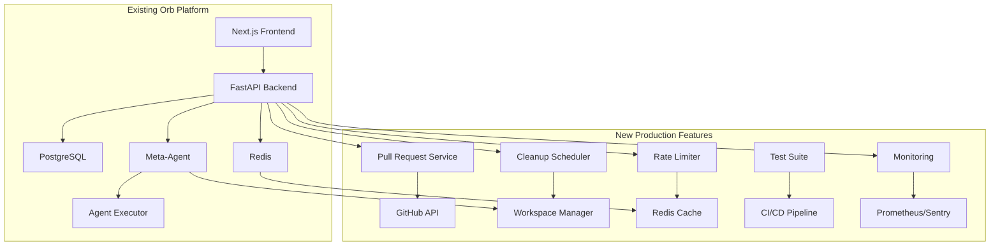

# Production Features Design

## Overview

This design document outlines the architecture for five critical production features that will complete the Orb platform: Pull Request automation, Workspace cleanup, Rate limiting, Comprehensive testing, and Production monitoring. These features integrate with the existing three-phase workflow (Research → Planning → Implementation) and maintain the current FastAPI + Next.js + Redis architecture.

## Architecture

### Current System Integration

The production features will integrate with the existing Orb architecture:



## Components and Interfaces

### 1. Pull Request System

**Location:** `src/github/pull_request_service.py`

```python
class PullRequestService:
    async def create_pull_request(
        self, 
        project_id: str, 
        repository_url: str, 
        feature_branch: str,
        implementation_summary: str
    ) -> Dict[str, Any]
    
    async def get_pr_template(self, changes: List[FileChange]) -> str
    async def add_pr_labels(self, pr_number: int, change_types: List[str]) -> None
    async def handle_branch_protection(self, repo: str, branch: str) -> bool
```

**Integration Points:**
- Called by Meta-Agent when implementation phase completes
- Uses existing GitHub App credentials from environment
- Publishes PR creation events to Redis for UI updates
- Stores PR metadata in PostgreSQL for tracking

### 2. Workspace Cleanup System

**Location:** `src/orchestrator/cleanup_scheduler.py`

```python
class CleanupScheduler:
    async def schedule_cleanup(self, workspace_path: str, delay_hours: int = 24) -> str
    async def cleanup_workspace(self, workspace_path: str) -> bool
    async def cleanup_expired_workspaces(self) -> List[str]
    async def is_workspace_active(self, project_id: str) -> bool
```

**Background Job System:**
- Redis-based task queue for scheduled cleanup
- Cron-like scheduler running every hour
- Workspace age tracking in PostgreSQL
- Safe cleanup with file lock detection

### 3. Rate Limiting System

**Location:** `src/middleware/rate_limiter.py`

```python
class RateLimiter:
    async def check_rate_limit(
        self, 
        key: str, 
        limit: int, 
        window_seconds: int
    ) -> Tuple[bool, Dict[str, Any]]
    
    async def get_user_limits(self, user_id: str) -> Dict[str, int]
    async def get_ip_limits(self, ip_address: str) -> Dict[str, int]
```

**FastAPI Middleware Integration:**
- Custom middleware for all API routes
- Redis sliding window rate limiting
- Different limits per endpoint category
- Proper HTTP 429 responses with retry headers

### 4. Test Suite Architecture

**Structure:**
```
tests/
├── unit/
│   ├── test_agents/
│   ├── test_tools/
│   ├── test_orchestrator/
│   └── test_api/
├── integration/
│   ├── test_workflow/
│   ├── test_github_integration/
│   └── test_redis_pubsub/
├── frontend/
│   ├── components/
│   └── pages/
└── e2e/
    └── test_full_workflow.py
```

**Testing Framework:**
- **Backend:** pytest with async support, factory-boy for fixtures
- **Frontend:** Jest + React Testing Library
- **E2E:** Playwright for full workflow testing
- **Coverage:** pytest-cov with 80% minimum threshold

### 5. Monitoring System

**Components:**

**Prometheus Metrics Service** (`src/monitoring/metrics.py`):
```python
class MetricsCollector:
    def track_api_request(self, endpoint: str, method: str, status_code: int, duration: float)
    def track_agent_execution(self, agent_name: str, success: bool, duration: float)
    def track_workspace_operation(self, operation: str, success: bool)
    def track_business_metric(self, metric_name: str, value: float, labels: Dict[str, str])
```

**Health Check System** (`src/monitoring/health.py`):
```python
class HealthChecker:
    async def check_database(self) -> HealthStatus
    async def check_redis(self) -> HealthStatus
    async def check_claude_api(self) -> HealthStatus
    async def check_github_api(self) -> HealthStatus
    async def get_system_health(self) -> SystemHealth
```

**Sentry Integration:**
- Error tracking for all exceptions
- Performance monitoring for API endpoints
- Custom tags for project_id, user_id, agent_name
- Release tracking for deployments

## Data Models

### Pull Request Tracking

```sql
-- Add to existing Prisma schema
model PullRequest {
  id            String    @id @default(uuid())
  projectId     String
  project       Project   @relation(fields: [projectId], references: [id])
  
  repositoryUrl String
  prNumber      Int
  prUrl         String
  branch        String
  status        PRStatus  @default(OPEN)
  
  createdAt     DateTime  @default(now())
  mergedAt      DateTime?
  closedAt      DateTime?
}

enum PRStatus {
  OPEN
  MERGED
  CLOSED
  DRAFT
}
```

### Cleanup Tracking

```sql
model WorkspaceCleanup {
  id            String    @id @default(uuid())
  projectId     String
  workspacePath String
  scheduledAt   DateTime
  completedAt   DateTime?
  status        CleanupStatus @default(SCHEDULED)
  errorMessage  String?
}

enum CleanupStatus {
  SCHEDULED
  IN_PROGRESS
  COMPLETED
  FAILED
}
```

## Error Handling

### Pull Request Failures
- **GitHub API errors:** Retry with exponential backoff (3 attempts)
- **Branch protection conflicts:** Create draft PR and notify user
- **Permission errors:** Log error and provide user guidance
- **Network failures:** Queue for retry with Redis

### Cleanup Failures
- **File lock errors:** Retry up to 3 times with 5-minute delays
- **Permission errors:** Log and alert system administrator
- **Disk space errors:** Emergency cleanup of oldest workspaces
- **Process failures:** Graceful degradation, manual cleanup option

### Rate Limiting Failures
- **Redis unavailable:** Fall back to in-memory rate limiting
- **Key corruption:** Reset rate limit counters
- **Clock skew:** Use Redis time for consistency

### Monitoring Failures
- **Prometheus unavailable:** Buffer metrics in Redis
- **Sentry unavailable:** Log errors locally
- **Health check failures:** Graceful degradation of dependent services

## Testing Strategy

### Unit Testing (80% Coverage Target)
- **Agent orchestration:** Mock Claude API responses
- **Tool execution:** Isolated tool testing with temporary workspaces
- **GitHub integration:** Mock GitHub API with realistic responses
- **Rate limiting:** Redis mock with time manipulation
- **Cleanup logic:** Temporary directory testing

### Integration Testing
- **Full workflow:** Research → Planning → Implementation → PR creation
- **Redis pub/sub:** Event publishing and consumption
- **Database operations:** Transaction testing with rollbacks
- **GitHub App:** Real GitHub API with test repositories

### Frontend Testing
- **Component testing:** React Testing Library for all components
- **API integration:** Mock API responses for all endpoints
- **User flows:** Playwright for critical user journeys
- **Real-time updates:** WebSocket/SSE testing

### Performance Testing
- **Load testing:** 100 concurrent users with k6
- **Rate limiting:** Verify limits under load
- **Memory usage:** Monitor for memory leaks during long-running tests
- **Database performance:** Query optimization validation

## Security Considerations

### GitHub Integration
- **Token security:** Encrypt GitHub tokens in database
- **Scope limitation:** Minimal required permissions for GitHub App
- **Rate limiting:** Respect GitHub API rate limits
- **Webhook validation:** Verify GitHub webhook signatures

### Workspace Security
- **Path traversal:** Validate all workspace paths
- **File permissions:** Proper cleanup of sensitive files
- **Process isolation:** Sandbox all git operations
- **Cleanup verification:** Ensure complete file deletion

### API Security
- **Authentication:** Verify JWT tokens on all protected endpoints
- **Authorization:** Role-based access control for admin features
- **Input validation:** Sanitize all user inputs
- **CORS:** Restrict origins to known frontends

## Deployment Integration

### Docker Updates
```yaml
# Add to docker-compose.yml
services:
  prometheus:
    image: prom/prometheus:latest
    ports:
      - "9090:9090"
    volumes:
      - ./monitoring/prometheus.yml:/etc/prometheus/prometheus.yml
      
  grafana:
    image: grafana/grafana:latest
    ports:
      - "3001:3000"
    environment:
      - GF_SECURITY_ADMIN_PASSWORD=admin
```

### Environment Variables
```bash
# Production monitoring
SENTRY_DSN=https://...
PROMETHEUS_ENABLED=true
METRICS_PORT=9090

# GitHub integration
GITHUB_APP_ID=123456
GITHUB_APP_PRIVATE_KEY_PATH=/app/github-key.pem

# Rate limiting
RATE_LIMIT_ENABLED=true
RATE_LIMIT_REDIS_PREFIX=rl:

# Cleanup scheduling
CLEANUP_ENABLED=true
CLEANUP_MAX_AGE_DAYS=7
CLEANUP_CHECK_INTERVAL_HOURS=1
```

### CI/CD Pipeline
```yaml
# .github/workflows/test.yml
name: Test Suite
on: [push, pull_request]
jobs:
  test:
    runs-on: ubuntu-latest
    services:
      postgres:
        image: postgres:15
      redis:
        image: redis:7
    steps:
      - uses: actions/checkout@v3
      - name: Run Backend Tests
        run: |
          pip install -r requirements.txt
          pytest tests/ --cov=src --cov-min=80
      - name: Run Frontend Tests
        run: |
          npm install
          npm run test:coverage
      - name: E2E Tests
        run: |
          docker-compose up -d
          npm run test:e2e
```

## Performance Considerations

### Pull Request Creation
- **Async processing:** Non-blocking PR creation with status updates
- **Batch operations:** Group multiple file changes into single PR
- **Caching:** Cache GitHub API responses for repository metadata
- **Retry logic:** Exponential backoff for failed API calls

### Workspace Cleanup
- **Background processing:** All cleanup operations run asynchronously
- **Batch cleanup:** Process multiple workspaces in single operation
- **Resource monitoring:** Monitor disk usage and adjust cleanup frequency
- **Graceful degradation:** Continue operation if some cleanups fail

### Rate Limiting
- **Redis optimization:** Use Redis pipelines for batch operations
- **Memory efficiency:** Sliding window with automatic expiration
- **Distributed consistency:** Handle multiple FastAPI instances
- **Performance impact:** < 1ms overhead per request

### Monitoring
- **Metric aggregation:** Batch metric collection to reduce overhead
- **Sampling:** Sample high-frequency events to reduce load
- **Async logging:** Non-blocking error reporting to Sentry
- **Resource usage:** Monitor monitoring system resource consumption

This design provides a comprehensive foundation for production-ready features while maintaining the existing Orb architecture and ensuring scalability, reliability, and maintainability.